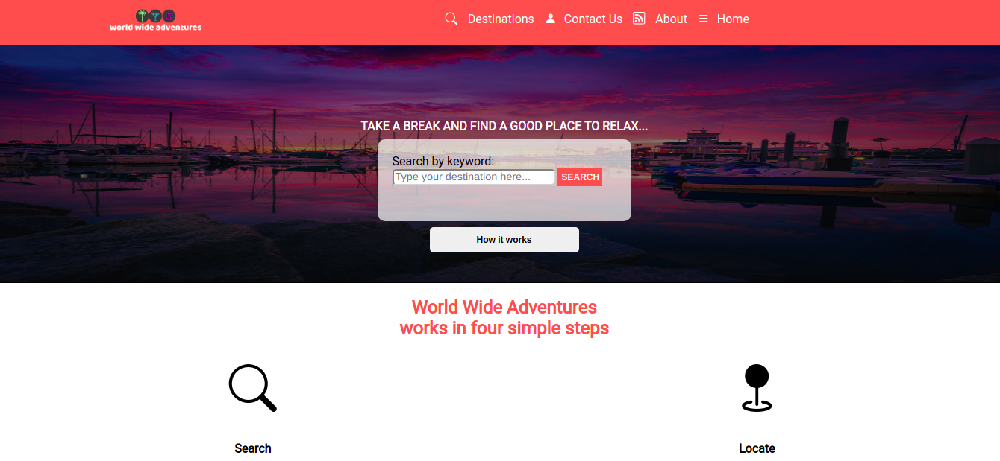

# Project Name

> Capstone Project - Inspired in Patashule website

In this project, I have cloned [this](https://www.behance.net/gallery/25563385/PatashuleKE/) Patashule website by using RWD concept. I have implemented HTML5 and CSS, making proper use of semantic tags in the HTML and Grid and Flexbox layout in the CSS.

## Instructions

There are only 3 main sections that actually respond to user interaction. Please note the following:

- index.html is the main page of the website containing a search bar and a brief description of the service/website
- The search button in the index.html header will take you to a Search Results Page (search-results.html)
- Once in the Search Results Page, you can click on any images from the results and will take you to the description of the location selected.

## Built With

- HTML5
- CSS

## Live Demo

[Live Demo Link](https://alexjustalex2020.github.io/capstone-directory/)

## Getting Started

**To get a local copy up and running follow these simple steps.**

### Prerequisites

-Web browser

### Setup

-Download/Clone the repository files and navigate to index.html.

### Install

-No installation required

### Deployment

-You can deploy this project by cloning it then:

- Go to the repository's settings.
- Navigate to the GitHub Pages section.
- Select the appropriate branch.
- Submit your changes.

## Author

👤 **Author**

- GitHub: [@Alex ](https://github.com/alexandermorales-dev/)
- Twitter: [@Alexand81099721 ](https://twitter.com/Alexand81099721)
- LinkedIn: [AlexanderMorales](https://www.linkedin.com/in/alexander-morales-b8539898/)

## 🤝 Contributing

Contributions, issues, and feature requests are welcome!

Feel free to check the [issues page](../../issues/).

## Show your support

Give a ⭐️ if you like this project!

## Acknowledgments

- [Microverse](https://www.microverse.org/)
- [Patashule](https://www.behance.net/gallery/25563385/PatashuleKE/)

## 📝 License

License under [Creative Commons](https://creativecommons.org/licenses/by-nc/4.0/)
